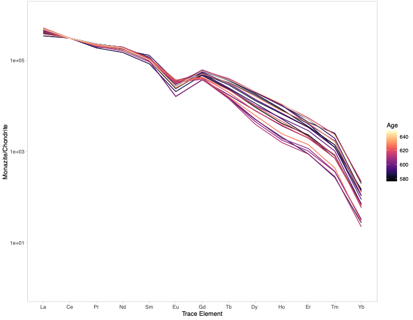
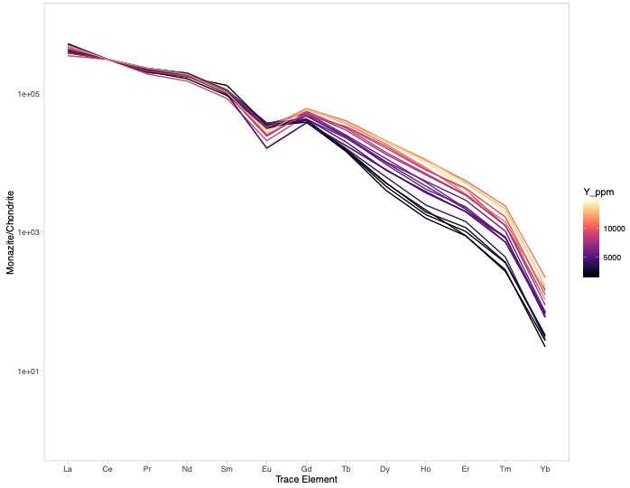

# plot_petrochron
Simple R script to plot trace element data coloured by age

* Inset your trace element data following the provided example input file "example_input.xlsx"
* Note that the code was preliminarly wrote for plotting monazite trace element data colored by age (Ma) or Y (ppm). With minor adjustments in the plotting section is also possible to plot zircon or other petrochronometer as well.

Check some examples:

% script based on "Coloured Trace Element Spider Plots.R" (prof. Kyle Larson) - DOI 10.17605/OSF.IO/P46MB %
