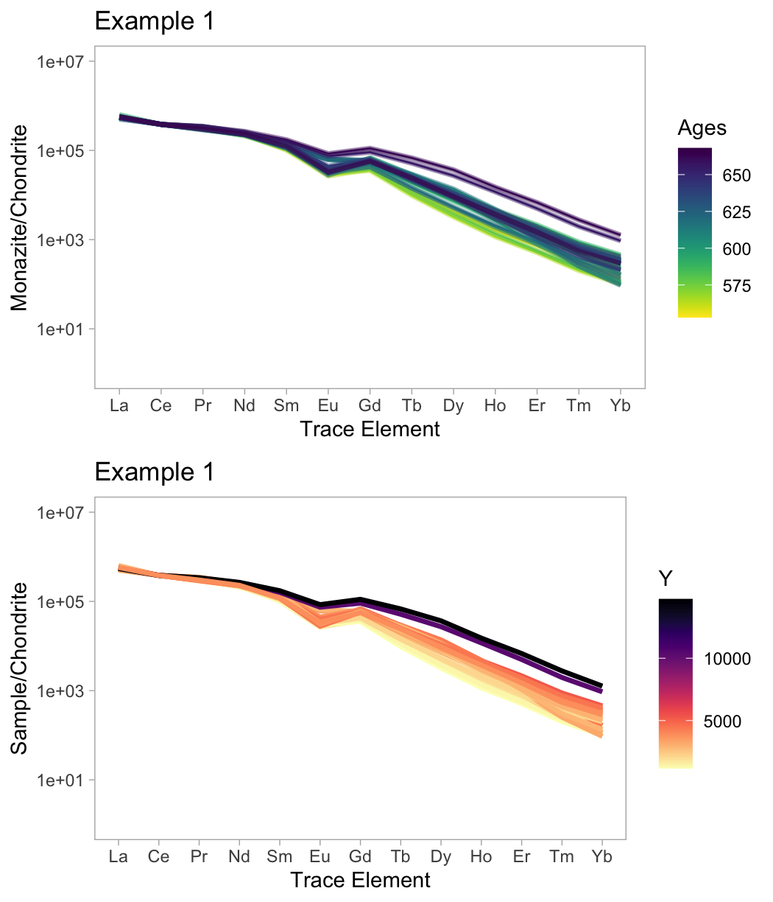
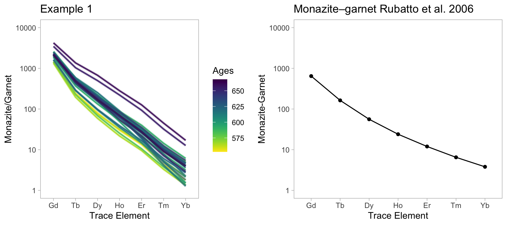

# plot_petrochron --> Simple R scripts for Petrochronology.

Files
# Trace_elements_diagram.R
To plot trace-element data coloured by age and other elements
# Mnz-Grt_partitioning.R
To plot trace-element partitioning between monazite and garnet coloured by age and plot the equilibrium curve from Rubatto et al., (2006).

* Inset your trace element data following the provided example input file "example_input.xlsx"
* Note that the code was preliminarly written to plot monazite trace element data coloured by age (Ma) or Y (ppm). With minor adjustments in the plotting section is also possible to have good results for zircon, for example.

Check some examples:

% script based on "Coloured Trace Element Spider Plots.R" (prof. Kyle Larson) - DOI 10.17605/OSF.IO/P46MB %
